Entra ID Device Onboarding Lab

Overview

This project demonstrates how to create a Windows virtual machine using Hyper-V and onboard it into Microsoft Entra ID for enterprise identity management.

Lab Setup

Hyper-V Virtual Machine Creation

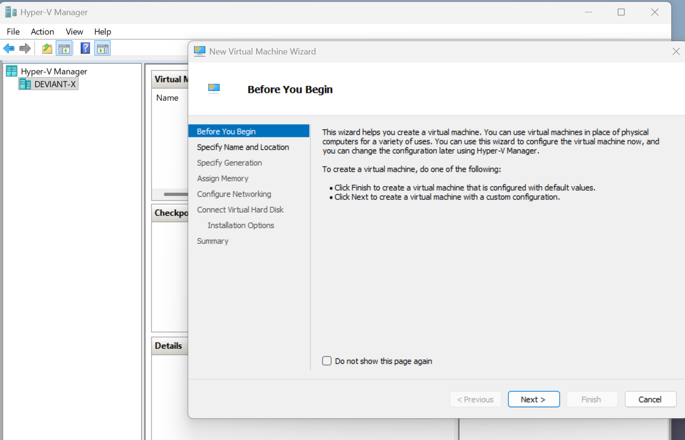

Specify Name and Location

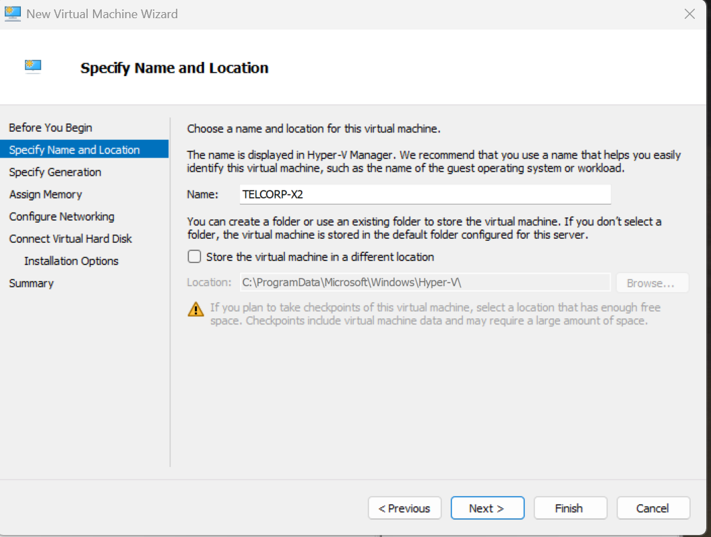

Assign Memory

 Configure Network

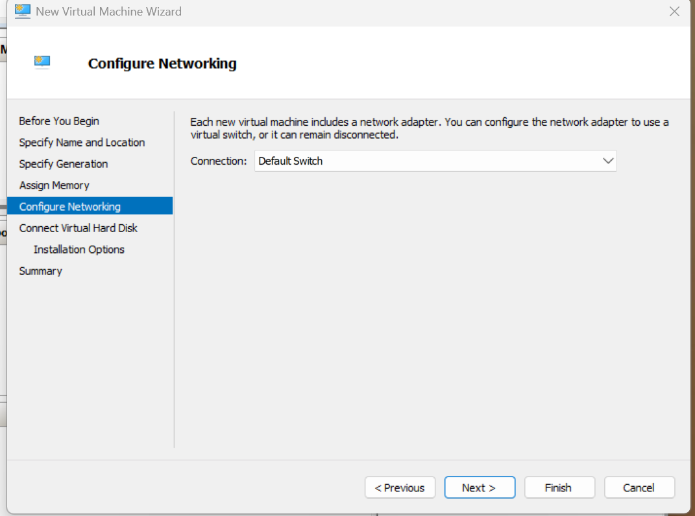

Configure Virtual Hard Disk

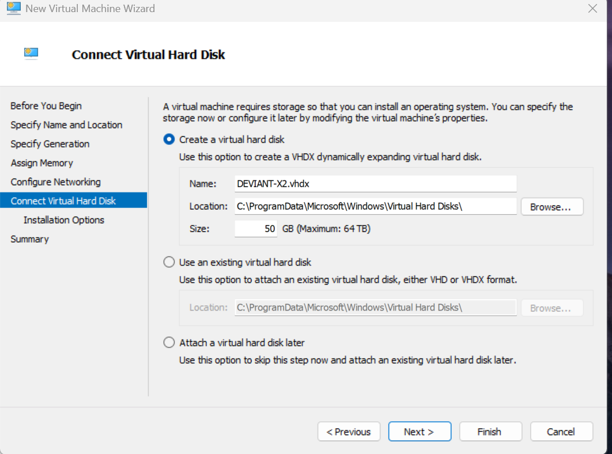

Windows Installation

Start Windows Installation

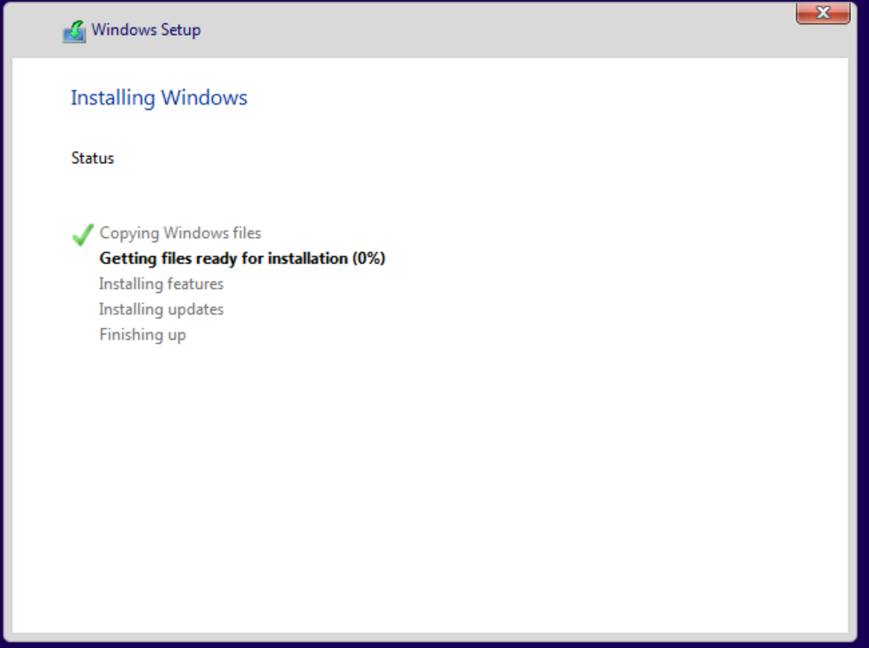

 Operating System Installation Process

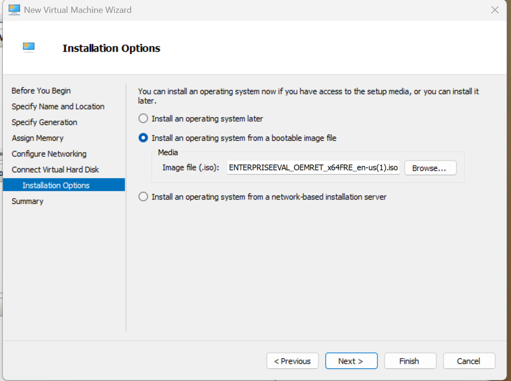

 Entra ID Integration

 Access Work or School (Before Join)

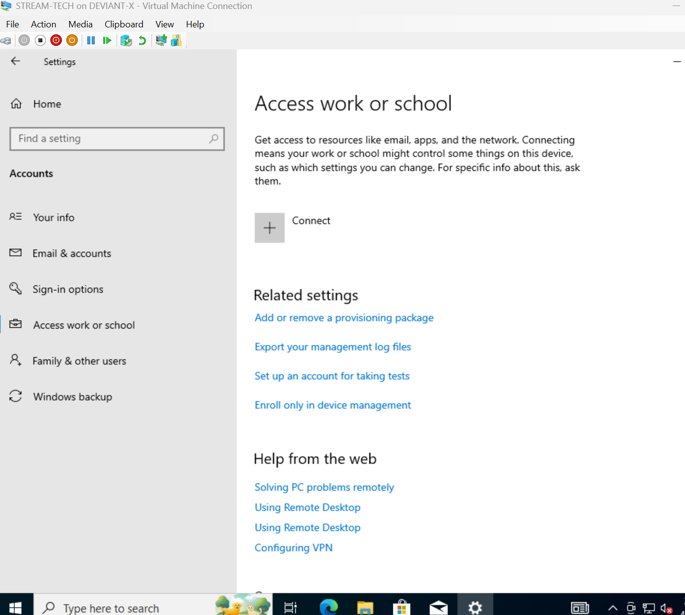

Initiate Entra ID Join

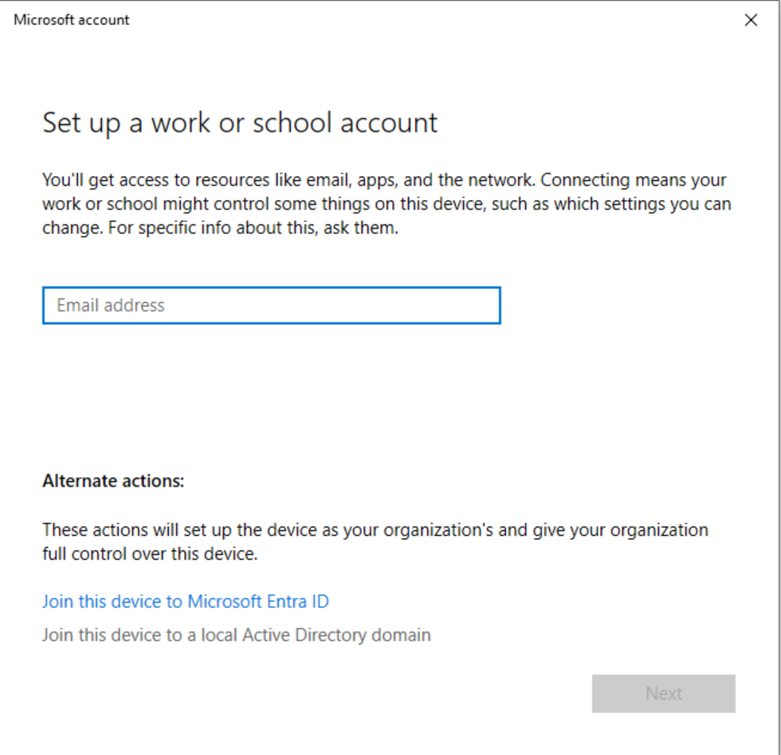

 User Authentication

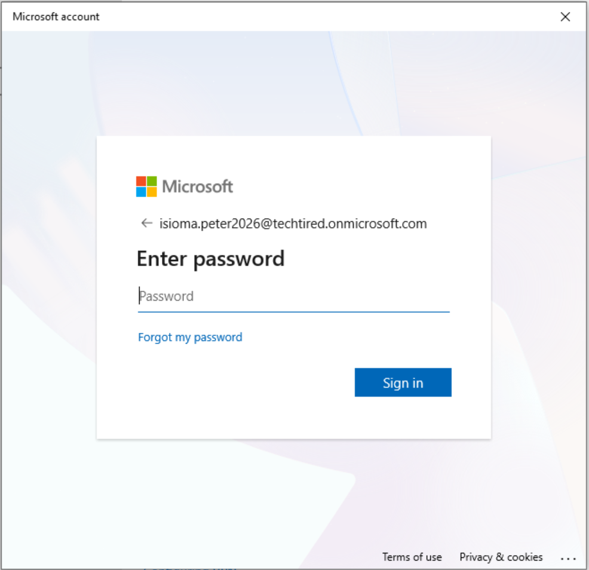

 Confirm Organization Join

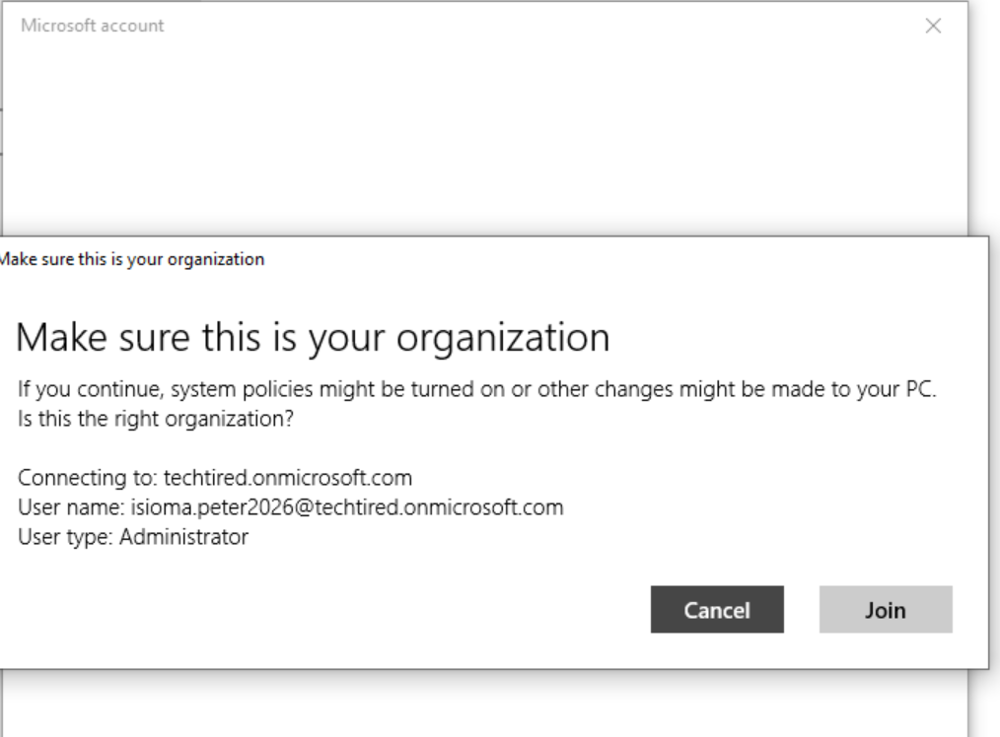

 Device Successfully Joined

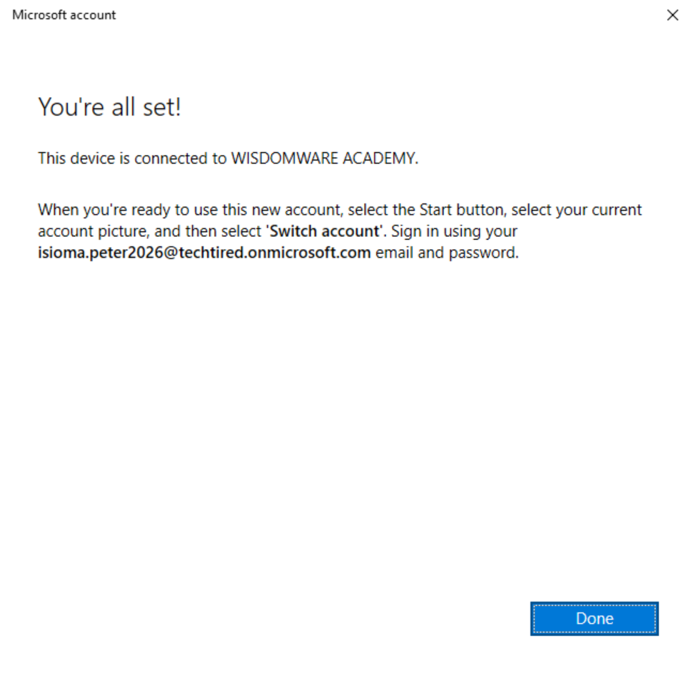

 Additional Join Confirmation

.png)

 Verification

 Verify Device Registration (dsregcmd)

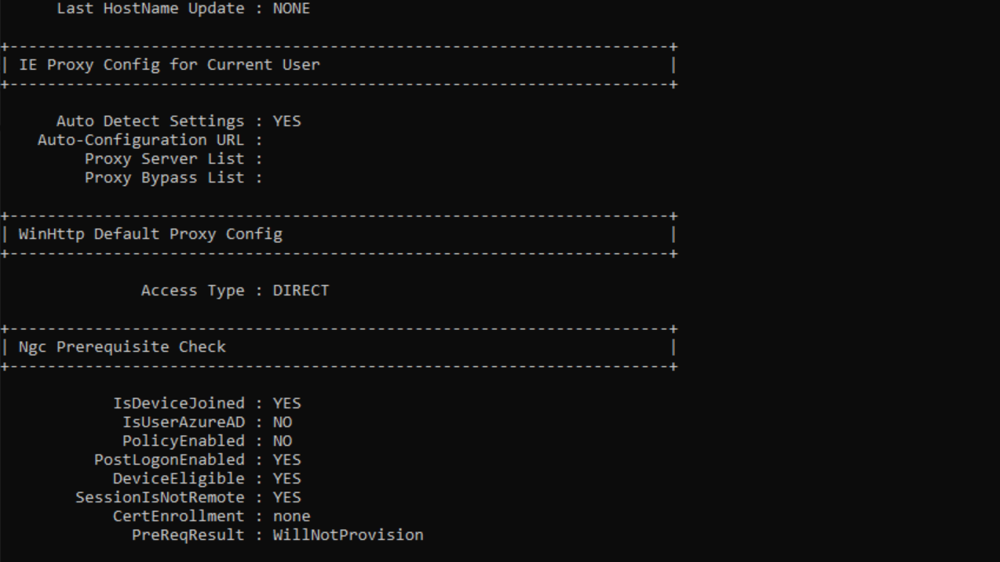

 Tenant Details Confirmation

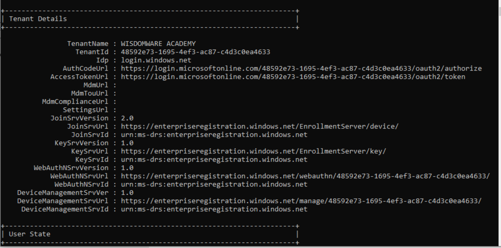

 RBAC Observation

 Intune Access Restriction

 Key Takeaway

This lab demonstrates practical enterprise device onboarding and highlights how RBAC policies can restrict access even after a successful device join.
Access should be granted by intune Admin.
